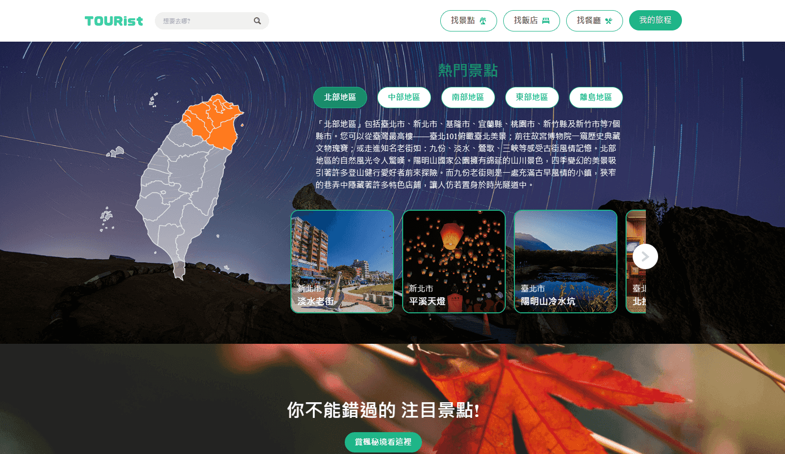

# 作品說明

The F2E 台灣旅遊景點服務，串接交通部 TDX 開放資料，

提供旅遊導覽介紹網站，串接交通部TDX的API資料，將取得資料渲染於頁面中展示

可依照不同縣市或搜尋關鍵字來取得想要的旅遊資訊。

此作品全站為RWD響應式頁面。




## 網站 Demo
[githubpage](https://egg8833.github.io/travelTaiwan/)


# 作品使用技術與環境說明
* 以 vue3 環境建立 使用composition api開發 並以Uno Css撰寫樣式 輔以Scss編寫樣式。
* Vite
* VueUse
* VueRouter
* pinia
* Axios
* JsSHA
* UnoCss
* ESlint
* SCSS


# 串接 API 資料

## TDX
### v2 (https://tdx.transportdata.tw/api-service/swagger/basic/cd0226cf-6292-4c35-8a0d-b595f0b15352#/Tourism/TourismApi_ScenicSpot_2240)

```
取得所有觀光景點資料
- Tourism/TourismApi_ScenicSpot_2240

```